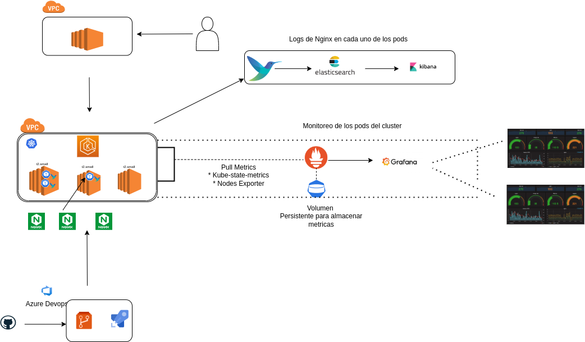

# Proyecto Devops 2023

Este proyecto tiene como idea principal el aprendizaje sobre distintos temas y poner en práctica lo aprendido a través de un laboratorio que permita integrar diferentes herramientas y tecnologías.

Durante la  primera parte nos centramos en la creación de una instancia de `EC2` en AWS para poder desde allí realizar todas las tareas
 necesarias. 

Luego comenzamos con el despligue de un cluster de Kubernetes con con la opción de `ekcli`
Una vez configurado el cluster, integramos un repositorio de Git en un proyecto de `Azure Devops`, mediante lo cual se puede demostrar 
la integración continua y el despliegue continuo `(CI/CD)` mediante el despligue en el cluster de 3 replicas de `nginx`.

En la segunda parte, configuraremos monitoreo de log con el stack de  `Elastic`, `FluentBit` y `Kibana`, el cual nos permitio ver los logs 
de nginx corriendo el el cluster 
Por último, configuramos la part de monitoreo de pods con el stack de `prometheus` y `grafana` `Prometheus`

## Contenido del proyecto

1. Crear y configurar instancia EC2

2. Configurar instancia y cliente aws

3. Crear cluster con eksctl

4. Crear cluster con terraform

5. Configurar kubectl

6. Azure Devops Setup

7. Github Actions

8. Herramientas de monitoreo

# Bibliografía

<!-- #  Docker Compose Examples // -->

<!--
- [Compose101 Slides](https://www.slideshare.net/ajeetraina/introduction-to-docker-compose-docker-intermediate-workshop)
- [Introduction to Docker Compose](http://dockerlabs.collabnix.com/intermediate/docker-compose/)
- [Dockerfile Vs Docker compose ](http://dockerlabs.collabnix.com/intermediate/workshop/DockerCompose/Difference_between_dockerfile_and_docker_compose.html)
- [How to Install Docker Compose? ](http://dockerlabs.collabnix.com/intermediate/workshop/DockerCompose/How_to_Install_Docker_Compose.html)

### Kubernetes
- [Setup AWS Free Tier](https://cloudkatha.com/how-to-setup-your-aws-free-tier-account-the-right-way/)

### Monitoreo
-->
